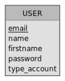

# Modèle de page de connexion

## Introduction
Parce que c'est un besoin récurrent dans de nombreux projets web.
Voici un petit modèle de page de connexion comprenant la phase de connexion/déconnexion ainsi que la phase d'inscription.

## User stories 
En tant que|Je veux pouvoir| Dans le but de|
|---|---|---|
|Utilisateur|Créer un compte|Devenir membre|
|Membre|Me connecter|Profiter pleinement du site|
|Membre|Me Déconnecter|Partir du site|
|Membre|Modifier mes données personelles|mettre à jour mon profil|
|Membre|Supprimer mon compte|Partir du site|
|Membre|Afficher mes données personelles|Consulter mes données|
|Administrateur|Supprimer un compte|supprimer un membre|
|Administrateur|Ajouter un compte|ajouter un membre|
|Administrateur|Me connecter|Gérer le site|
|Administrateur|Me Déconnecter|Partir du site|

## MCD
